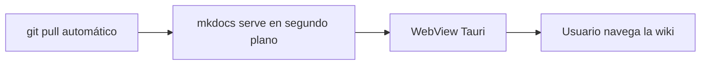

# Wiki Desktop Client

Prueba de concepto del motor de renderizado (MkDocs + Material) que luego se empaquetará dentro de un cascarón Tauri.

## Diagrama de ejemplo (Mermaid)



## Bloque de código

```python
def hola():
    return "mkdocs-material funcionando"
```

## Prueba de wikilinks estilo Obsidian

Enlace simple, resuelto solo por nombre (sin indicar la carpeta `notas/`):
[[Nota Con Espacios]]

Enlace con alias:
[[Nota Con Espacios|Ver la nota de prueba]]

Enlace con ancla a una sección específica:
[[Nota Con Espacios#Sección de prueba]]

Embebido de imagen (resuelto sin indicar la carpeta `imagenes/`):
![[diagrama.png]]

Transclusión completa de la nota:
![[Nota Con Espacios]]

Enlace roto a propósito (para ver cómo se reporta):
[[Nota Que No Existe]]
