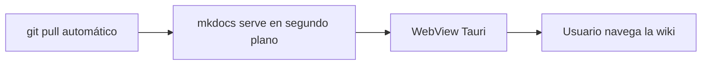

# Wiki Desktop Client

Prueba de concepto del motor de renderizado (MkDocs + Material) que luego se empaquetará dentro de un cascarón Tauri.

## Diagrama de ejemplo (Mermaid)



## Bloque de código

```python
def hola():
    return "mkdocs-material funcionando"
```
